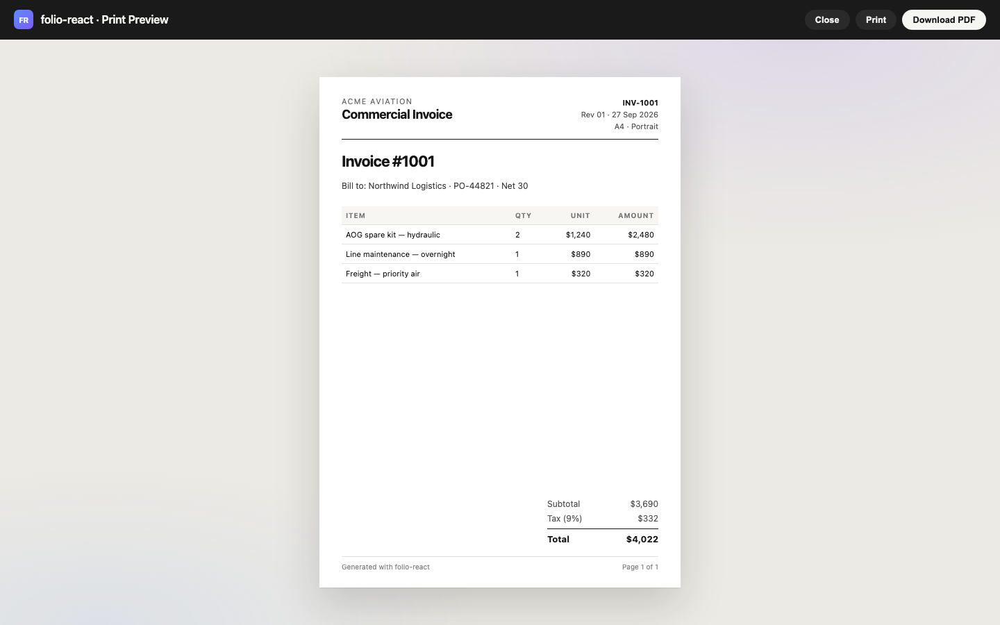
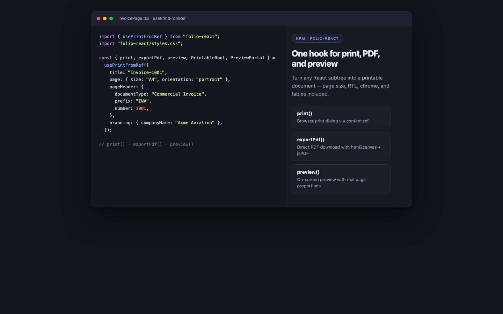
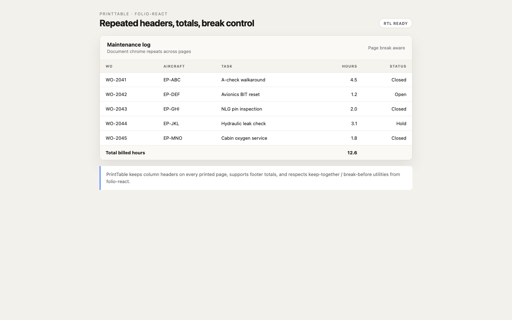

# folio-react

**React toolkit for browser printing, PDF export, and print preview** — built around a content `ref`, with configurable page sizes, headers/footers, RTL layout, advanced tables, and reusable document building blocks.

| | |
| --- | --- |
| **Package** | `folio-react` |
| **Version** | `0.2.3` |
| **License** | MIT |
| **Module** | ESM |
| **React** | ≥ 18 |
| **TypeScript** | First-class (bundled `.d.ts`) |

<p align="center">
  
</p>

<p align="center">
  
</p>

<p align="center">
  
</p>

---

## Table of contents

1. [What this library does](#what-this-library-does)
2. [Installation](#installation)
3. [Styles](#styles)
4. [Quick start](#quick-start)
5. [Core concepts](#core-concepts)
6. [`usePrintFromRef` API](#useprintfromref-api)
7. [Printing](#printing)
8. [PDF export](#pdf-export)
9. [Print preview](#print-preview)
10. [Page configuration](#page-configuration)
11. [Page numbering](#page-numbering)
12. [RTL layout](#rtl-layout)
13. [Header, footer & branding](#header-footer--branding)
14. [Watermark](#watermark)
15. [Theme & fonts](#theme--fonts)
16. [PrintTable](#printtable)
17. [Document building blocks](#document-building-blocks)
18. [Workspace provider](#workspace-provider)
19. [Low-level utilities](#low-level-utilities)
20. [CSS architecture & tokens](#css-architecture--tokens)
21. [Page-break utilities](#page-break-utilities)
22. [Full report example](#full-report-example)
23. [SSR & Next.js notes](#ssr--nextjs-notes)
24. [Browser limitations](#browser-limitations)
25. [Package exports](#package-exports)
26. [Migration notes](#migration-notes)
27. [Scripts](#scripts)
28. [Troubleshooting](#troubleshooting)

---

## What this library does

`folio-react` turns a React subtree into a printable / exportable document without forcing you to learn print CSS, `@page` rules, or PDF internals.

**Out of the box you get:**

- Browser **print** via [`react-to-print`](https://github.com/MatthewHerbst/react-to-print)
- Direct **PDF download** (optional peers: `html2canvas` + `jspdf`)
- On-screen **print preview** with real page proportions
- Configurable **page size / orientation / margins**
- Official document **chrome** (header, footer, generated-by mark)
- **RTL** document direction
- Advanced **PrintTable** (repeated headers, totals, break control)
- Building blocks: cover, section, page break, signature, watermark
- Compiled **CSS** — no Sass required for consumers

**What you do *not* need to do:**

- Write `@page { size: A4 landscape; }` yourself
- Build a separate PDF layout tree
- Ship Sass / design-token pipelines from this package
- Understand how the print iframe is constructed

---

## Installation

### Required

```bash
npm install folio-react
# or
pnpm add folio-react
# or
yarn add folio-react
```

**Peer dependencies** (usually already in your React app)

| Package | Version | Required for |
| --- | --- | --- |
| `react` | ≥ 18 | Runtime |
| `react-dom` | ≥ 18 | Runtime / portals |

`react-to-print` is a **direct dependency** of `folio-react` — you do **not** need to install it yourself.

### Optional (PDF export only)

```bash
npm install html2canvas jspdf
```

| Package | Version | Required for |
| --- | --- | --- |
| `html2canvas` | ≥ 1.4 | `exportPdf()` |
| `jspdf` | ≥ 2.5 | `exportPdf()` |

If these are missing, `exportPdf()` throws a clear install hint. Print and preview still work without them.

---

## Styles

Import the bundled CSS once in your app (e.g. root layout or entry file):

```ts
import "folio-react/styles.css";
```

Or import only what you need:

```ts
import "folio-react/styles/printTemplate.css"; // document chrome + layout
import "folio-react/styles/tablePrint.css";    // PrintTable
import "folio-react/styles/printPreview.css";  // preview dialog
import "folio-react/styles/tokens.css";        // CSS variables only
```

**Notes**

- No Sass installer is required.
- Legacy SCSS entrypoints (`./styles/printTemplate.scss`, `./styles/tablePrint.scss`) still resolve for older imports, but **CSS is the recommended path**.
- Design tokens are exposed as CSS custom properties on `.print-doc` / `:root` (see [CSS architecture](#css-architecture--tokens)).

---

## Quick start

```tsx
import { usePrintFromRef } from "folio-react";
import "folio-react/styles.css";

export function InvoicePage() {
  const { print, exportPdf, preview, PrintableRoot, PreviewPortal } =
    usePrintFromRef({
      title: "Invoice-1001",
      page: { size: "A4", orientation: "portrait", margin: "12mm" },
      pageHeader: {
        documentType: "Commercial Invoice",
        prefix: "INV",
        number: 1001,
        revision: 1,
        date: "2026-09-27",
      },
      branding: {
        companyName: "Acme Aviation",
        reportType: "Invoice",
        logoSrc: "/logo.png",
      },
    });

  return (
    <>
      <button type="button" onClick={() => preview()}>
        Preview
      </button>
      <button type="button" onClick={() => print()}>
        Print
      </button>
      <button
        type="button"
        onClick={() => exportPdf({ filename: "invoice-1001.pdf" })}
      >
        Download PDF
      </button>

      <PrintableRoot className="print-doc--report">
        <h1 className="print-title">Invoice #1001</h1>
        <p className="print-prose">Bill to: …</p>
      </PrintableRoot>

      {/* Required for preview() to render the dialog */}
      <PreviewPortal />
    </>
  );
}
```

---

## Core concepts

### `PrintableRoot`

A stable React component created by the hook. It:

1. Attaches the print `contentRef`
2. Renders document chrome (header / footer / generated-by / optional watermark)
3. Wraps your children in `.print-doc` / `#print-container`

Always mount `PrintableRoot` in the tree before calling `print()`, `exportPdf()`, or `preview()`.

### Off-screen hosting (optional)

If you do not want the printable document visible on screen, wrap it with `PrintHost`:

```tsx
import { PrintHost } from "folio-react";

<PrintHost>
  <PrintableRoot>…</PrintableRoot>
</PrintHost>
```

`PrintHost` parks content off-screen for screen UI, then becomes normal flow during print.

### `PreviewPortal`

Must be rendered (usually near the root of the page) so the preview dialog can portal into `document.body`.

---

## `usePrintFromRef` API

```ts
const {
  print,
  exportPdf,
  preview,
  closePreview,
  isPreviewOpen,
  PrintableRoot,
  PreviewPortal,
} = usePrintFromRef(options);
```

### Return value

| Name | Type | Description |
| --- | --- | --- |
| `print` | `() => void` | Opens the browser print dialog for the printable root |
| `exportPdf` | `(opts?) => Promise<void>` | Generates and downloads a real `.pdf` |
| `preview` | `(opts?) => void` | Opens the on-screen print preview |
| `closePreview` | `() => void` | Closes the preview dialog |
| `isPreviewOpen` | `boolean` | Whether preview is currently open |
| `PrintableRoot` | `Component` | Mount this around printable content |
| `PreviewPortal` | `() => ReactNode` | Render this once to host the preview UI |

### Options

All options are optional. Defaults favour A4 portrait with English chrome.

```ts
type PrintFromRefOptions = {
  /** External content ref. If omitted, an internal ref is used via PrintableRoot. */
  contentRef?: RefObject<HTMLElement | null>;

  /** Print job / PDF title. Prefer this over documentTitle. */
  title?: string;

  /** @deprecated Alias of `title` (still forwarded to react-to-print). */
  documentTitle?: string;

  /** Page size, orientation, margins. */
  page?: PageConfig;

  /** Document direction. Default `"ltr"`. */
  direction?: "ltr" | "rtl";

  /** Default header metadata (document type, id, revision, date). */
  pageHeader?: PrintPageHeaderConfig;

  /** Company / logo / generated-by branding. */
  branding?: PrintBranding;

  /** Replace the default header entirely. */
  header?: ReactNode;

  /** Replace the default footer entirely. */
  footer?: ReactNode;

  /** Page number CSS margin-box config. */
  pageNumber?: PageNumberConfig;

  /** Optional diagonal watermark. */
  watermark?: WatermarkConfig;

  /** CSS variable theme overrides. */
  theme?: PrintTheme;

  /** Font family + optional @font-face CSS. */
  font?: PrintFontPageStyleOptions;

  /** Extra CSS merged into the print stylesheet (react-to-print `pageStyle`). */
  pageStyle?: string;

  /** Optional table data rendered under children. */
  tableData?: PrintFromRefTableData | null;

  /** Whether to render `tableData`. Default `true`. */
  showTable?: boolean;

  // …plus remaining react-to-print options (except contentRef)
};
```

### Related types

```ts
type PrintPageHeaderConfig = {
  revision?: string | number;
  number?: string | number;
  prefix?: string | number;
  title?: string;
  documentType?: string;
  date?: string | number;
};

type PrintBranding = {
  logoSrc?: string | null;
  companyName?: string | null;
  reportType?: string | null;      // footer identity (short name)
  generatedByLabel?: string;       // vertical "Generated by" mark
  uncontrolledLabel?: string;      // uncontrolled-document notice
};
```

---

## Printing

```tsx
const { print, PrintableRoot } = usePrintFromRef({
  title: "Monthly Report",
  page: { size: "A4", orientation: "portrait" },
});

<button type="button" onClick={() => print()}>Print</button>
```

**How it works**

1. The hook configures `react-to-print` with your `contentRef`
2. It injects font, chrome, page-size, and page-number CSS into the print iframe
3. The browser opens its native print dialog

You can still pass most [`react-to-print`](https://github.com/MatthewHerbst/react-to-print) options through (e.g. `onBeforePrint`, `onAfterPrint`, `removeAfterPrint`).

---

## PDF export

```tsx
const { exportPdf, PrintableRoot } = usePrintFromRef({
  title: "Invoice",
  page: { size: "A4", orientation: "landscape" },
});

await exportPdf({
  filename: "invoice.pdf", // `.pdf` is appended if missing
  scale: 2,                // raster scale (default 2)
  imageQuality: 0.92,      // JPEG quality 0–1
});
```

**Requirements**

```bash
npm install html2canvas jspdf
```

**Behaviour**

- Captures the mounted `PrintableRoot` DOM
- Respects page size and orientation
- Slices tall content into multiple PDF pages
- Triggers a browser download

**Low-level API** (advanced):

```ts
import { exportPdfFromElement } from "folio-react";

await exportPdfFromElement({
  element: document.getElementById("print-container")!,
  filename: "custom.pdf",
  page: { size: "Letter", orientation: "portrait" },
});
```

See [Browser limitations](#browser-limitations) for honest caveats (rasterization, CORS images, fonts).

---

## Print preview


```tsx
const { preview, closePreview, isPreviewOpen, PrintableRoot, PreviewPortal } =
  usePrintFromRef({
    title: "Invoice",
    page: { size: "A4", orientation: "portrait" },
  });

return (
  <>
    <button type="button" onClick={() => preview()}>
      Preview {isPreviewOpen ? "(open)" : ""}
    </button>

    <PrintableRoot>…</PrintableRoot>
    <PreviewPortal />
  </>
);
```

**What preview does**

- Clones the **live printable markup** (not a screenshot)
- Frames it into sheets with correct A4 / A3 / Letter / … proportions
- Respects portrait / landscape
- Shows headers, footers, and page labels
- Offers Print / Download PDF / Close actions
- Closes on `Escape` or backdrop click

You can also use `PrintPreview` directly if you manage open state yourself:

```tsx
import { PrintPreview } from "folio-react";

<PrintPreview
  open={open}
  onClose={() => setOpen(false)}
  onPrint={() => print()}
  onDownloadPdf={() => exportPdf()}
  title="Invoice"
  page={{ size: "A4", orientation: "portrait" }}
  direction="ltr"
  contentRef={contentRef}
/>
```

---

## Page configuration

Remove hardcoded A4 assumptions — configure everything through `page`:

```tsx
usePrintFromRef({
  page: {
    size: "A4",           // "A4" | "A3" | "A5" | "Letter" | "Legal"
    orientation: "landscape", // "portrait" | "landscape"
    margin: "12mm",       // string or { top, right, bottom, left }
  },
});
```

### Margin forms

```ts
margin: "12mm"
margin: "14mm 8mm 16mm 15mm"
margin: { top: "10mm", right: "8mm", bottom: "10mm", left: "8mm" }
```

Default margin: `"14mm 8mm 16mm 15mm"`.

### Physical sizes (portrait, mm)

| Size | Width | Height |
| --- | ---: | ---: |
| A4 | 210 | 297 |
| A3 | 297 | 420 |
| A5 | 148 | 210 |
| Letter | 215.9 | 279.4 |
| Legal | 215.9 | 355.6 |

Landscape swaps width/height automatically.

### Helpers

```ts
import {
  PAGE_SIZE_MM,
  DEFAULT_PAGE_CONFIG,
  resolvePageDimensions,
  formatPageSizeRule,
  formatPageMargin,
} from "folio-react";

resolvePageDimensions({ size: "A4", orientation: "landscape" });
// → { widthMm: 297, heightMm: 210 }

formatPageSizeRule({ size: "Letter", orientation: "portrait" });
// → "Letter portrait"
```

Consumers never need to write:

```css
@page {
  size: A4 landscape;
}
```

The library injects the correct `@page` rule into the print stylesheet.

---

## Page numbering

```tsx
usePrintFromRef({
  pageNumber: {
    enabled: true, // default true
    format: "Page {current} of {total}",
  },
});
```

Tokens:

| Token | Meaning |
| --- | --- |
| `{current}` | Current page (CSS `counter(page)`) |
| `{total}` | Total pages (CSS `counter(pages)`) |

Examples:

```ts
format: "Page {current} of {total}"
format: "{current}/{total}"
format: "p. {current}"
```

For RTL documents (`direction: "rtl"`), the margin box is mirrored (`@bottom-left` instead of `@bottom-right`).

**Browser note:** CSS `@page` margin boxes are not equally supported in every engine. The footer also reserves a pagination slot as a visual fallback in layout/PDF chrome modes.

Helper:

```ts
import { formatPageNumber } from "folio-react";

formatPageNumber("Page {current} of {total}", 2, 8);
// → "Page 2 of 8"
```

---

## RTL layout

```tsx
usePrintFromRef({
  direction: "rtl",
  title: "Report",
});
```

This sets `dir="rtl"` on the printable root and adjusts:

- Header / footer alignment
- Generated-by vertical mark side
- Table text alignment (logical `start` / `end`)
- Page-number margin box side
- Preview dialog direction

UI chrome strings remain English. To localize chrome, pass custom `header` / `footer` nodes or branding overrides (`generatedByLabel`, `uncontrolledLabel`).

---

## Header, footer & branding

### Default chrome via options

```tsx
usePrintFromRef({
  pageHeader: {
    documentType: "Safety Risk Assessment Record", // header kicker
    prefix: "BKN",
    number: "SR-1009", // → document id "BKN-SR-1009"
    revision: 0,       // → "Rev. 00"
    date: "2026-09-27", // → "Issued 2026-09-27"
  },
  branding: {
    companyName: "BKN JET",
    reportType: "Safety Risk Report", // footer short name
    logoSrc: "https://cdn.example.com/logo.png",
    generatedByLabel: "Generated by Acme Print",
    uncontrolledLabel: "Uncontrolled when printed",
  },
});
```

### Fully custom header / footer

```tsx
usePrintFromRef({
  header: <MyCompanyHeader />,
  footer: <MyCompanyFooter />,
});
```

Passing `header` / `footer` replaces the defaults entirely.

### Compose manually

```tsx
import {
  PrintPageHeader,
  PrintPageFooter,
  PrintPageGenerated,
} from "folio-react";
```

### Uncontrolled documents

When using `PrintWorkspaceProvider` with `isUncontrolledDocument: true`, the footer shows the uncontrolled notice (default: `"Control Not Established"`).

---

## Watermark

Via hook options:

```tsx
usePrintFromRef({
  watermark: {
    text: "CONFIDENTIAL",
    opacity: 0.08,
    rotate: "-30deg",
  },
});
```

Or as a component inside the document:

```tsx
import { PrintWatermark } from "folio-react";

<PrintableRoot>
  <PrintWatermark text="DRAFT" opacity={0.1} />
  …
</PrintableRoot>
```

---

## Theme & fonts

### Theme object

```tsx
usePrintFromRef({
  theme: {
    fontFamily: "Tahoma, Arial, sans-serif",
    fontSize: "11px",
    primaryColor: "#0f4c81",
    textColor: "#111827",
    mutedColor: "#6b7280",
    borderColor: "#d1d5db",
    paperColor: "#ffffff",
    background: "#ffffff",
    spacing: "12px",
  },
});
```

These map onto CSS variables on the printable root.

### Custom / web fonts

Fonts are **not** bundled. Host them yourself and inject `@font-face`:

```tsx
usePrintFromRef({
  font: {
    fontFamily: '"Vazirmatn", Tahoma, Arial, sans-serif',
    fontFaceCss: `
      @font-face {
        font-family: "Vazirmatn";
        src: url("/fonts/Vazirmatn-Regular.woff2") format("woff2");
        font-weight: 400;
        font-display: swap;
      }
    `,
  },
});
```

**PDF tip:** ensure fonts are fully loaded before calling `exportPdf()`, otherwise canvas capture may fall back to system fonts.

### Manual page-style merge

```ts
import {
  getPrintDocumentPageStyle,
  mergePrintPageStyle,
} from "folio-react";

const pageStyle = mergePrintPageStyle({
  customPageStyle: getPrintDocumentPageStyle("my-doc-root", {
    page: { size: "A4", orientation: "portrait" },
  }),
  font: { fontFamily: "Georgia, serif" },
  direction: "ltr",
  pageNumber: { enabled: true },
});
```

---

## PrintTable


```tsx
import { PrintTable } from "folio-react";
import "folio-react/styles/tablePrint.css";

<PrintTable
  meta={<span>Appendix A</span>}
  columns={[
    { key: "item", header: "Item" },
    { key: "qty", header: "Qty", className: "print-table__cell--center" },
    { key: "amount", header: "Amount", className: "print-table__cell--right" },
  ]}
  columnWidths={["50%", "20%", "30%"]}
  rows={[
    {
      key: "1",
      cells: { item: "Jet fuel", qty: "10", amount: "$1,000" },
    },
    {
      key: "section-1",
      section: true,
      cells: { item: "Extras", qty: "", amount: "" },
    },
    {
      key: "2",
      breakInside: "auto", // allow this tall row to split if needed
      cells: {
        item: "Long notes…",
        qty: "1",
        amount: "$50",
      },
    },
  ]}
  subtotal={{
    key: "sub",
    cells: { item: "Subtotal", qty: "", amount: "$1,050" },
  }}
  totals={[
    {
      key: "total",
      cells: { item: "Total", qty: "", amount: "$1,050" },
    },
  ]}
  repeatHeader // default true — thead repeats across printed pages
/>
```

### Row options

| Option | Values | Default | Purpose |
| --- | --- | --- | --- |
| `breakInside` | `"avoid"` \| `"auto"` | `"avoid"` | Prefer keeping the row on one page |
| `section` | `boolean` | `false` | Style as a section header row |
| `className` | `string` | — | Row class |
| `cellClassName` | `Record<string, string>` | — | Per-cell classes |

### Totals / summary

- `subtotal` — single row prepended to footer
- `totals` — footer rows
- `summary` — extra footer rows appended after totals

Rendered inside `<tfoot>` so they participate correctly in print pagination.

### Via hook `tableData`

```tsx
usePrintFromRef({
  showTable: true,
  tableData: {
    columns,
    rows,
    totals,
    columnWidths: ["40%", "30%", "30%"],
  },
});
```

The table is appended under `PrintableRoot` children.

---

## Document building blocks

Import only what you need:

```tsx
import {
  PrintDocument,
  PrintHost,
  PrintPage,
  PrintPageBreak,
  PrintSection,
  PrintCover,
  PrintSignature,
  PrintWatermark,
  PrintHistorySection,
  printDocumentClassName,
} from "folio-react";
```

### `PrintCover`

First-page cover with automatic page break after:

```tsx
<PrintCover title="Annual Safety Report" subtitle="FY 2026">
  <p className="print-muted">Confidential</p>
</PrintCover>
```

### `PrintSection`

```tsx
<PrintSection title="Findings" avoidBreak>
  <p className="print-prose">…</p>
</PrintSection>
```

### `PrintPageBreak`

```tsx
<PrintPageBreak />
```

### `PrintSignature`

```tsx
<PrintSignature
  name="Jane Doe"
  role="Approved By"
  date="2026-09-27"
/>
```

### `PrintPage` / `PrintDocument` / `PrintHost`

```tsx
<PrintHost>
  <PrintableRoot className={printDocumentClassName("report", "report-root")}>
    <PrintDocument>
      <PrintPage>
        <p>Page-like section</p>
      </PrintPage>
      <PrintPage>
        <p>Another section</p>
      </PrintPage>
    </PrintDocument>
  </PrintableRoot>
</PrintHost>
```

### `PrintHistorySection`

```tsx
import {
  PrintHistorySection,
  usePrintHistoryLabels,
} from "folio-react";

const labels = usePrintHistoryLabels({ title: "Change log" });

<PrintHistorySection
  entries={[
    {
      id: "1",
      occurredAt: "2026-09-27T10:00:00Z",
      actor: "Ozan",
      action: "Updated",
      detail: "Linked risk SR-1009",
    },
  ]}
  labels={labels}
  formatDate={(value) => value?.slice(0, 10) ?? "—"}
/>
```

---

## Workspace provider

Share company branding across many print roots:

```tsx
import { PrintWorkspaceProvider } from "folio-react";

export function App() {
  return (
    <PrintWorkspaceProvider
      value={{
        companyName: "Acme Aviation",
        logo: "https://example.com/logo.png",
        isUncontrolledDocument: true,
      }}
    >
      <Reports />
    </PrintWorkspaceProvider>
  );
}
```

Per-document `branding` on the hook overrides workspace values when both are set.

Hook for consumers inside the provider:

```ts
import { usePrintWorkspace } from "folio-react";

const { companyName, logo, isUncontrolledDocument } = usePrintWorkspace();
```

---

## Low-level utilities

Useful when you need custom print pipelines:

```ts
import {
  // Page geometry
  PAGE_SIZE_MM,
  DEFAULT_PAGE_CONFIG,
  resolvePageDimensions,
  formatPageMargin,
  formatPageSizeRule,

  // Stylesheet builders
  getPrintFontPageStyle,
  getPrintChromePageStyle,
  getPrintPageNumberPageStyle,
  getPrintDocumentPageStyle,
  mergePrintPageStyle,

  // PDF
  exportPdfFromElement,

  // Meta formatters
  formatPrintDocumentId,
  formatPrintRevision,
  getPrintDocumentType,
  joinPrintMeta,
  resolvePrintFooterDocumentType,
  PRINT_META_SEPARATOR,
  formatPageNumber,

  // Labels
  DEFAULT_PRINT_LABELS,
  DEFAULT_PRINT_HISTORY_LABELS,

  // Advanced root factory
  useStablePrintableRoot,
  createPrintableRoot,
  assignRef,
} from "folio-react";
```

### `useStablePrintableRoot`

Creates a long-lived `PrintableRoot` + `contentRef` without wiring print/PDF:

```tsx
const { contentRef, PrintableRoot } = useStablePrintableRoot({
  pageHeader: { documentType: "Checklist" },
  branding: { companyName: "Acme" },
});
```

---

## CSS architecture & tokens

Default tokens (override on `.print-doc` or `:root`):

```css
.print-doc {
  --print-ink: #111827;
  --print-muted: #6b7280;
  --print-faint: #8a8a8a;
  --print-rule: #d1d5db;
  --print-rule-strong: #111827;
  --print-surface: #f8fafc;
  --print-accent: #1a4c99;
  --print-accent-soft: #eaf2ff;
  --print-danger: #991b1b;
  --print-paper: #ffffff;
  --print-font-family: Arial, Helvetica, sans-serif;
  --print-font-size: 12px;
  --print-spacing: 12px;
}
```

### Useful layout classes

| Class | Role |
| --- | --- |
| `.print-doc` | Root printable surface |
| `.print-doc--report` | Report layout mode |
| `.print-doc__body` | Main content column |
| `.print-title` / `.print-heading` / `.print-kicker` | Typography |
| `.print-prose` / `.print-muted` | Body text |
| `.print-card` / `.print-meta-grid` / `.print-callout` | Content blocks |
| `.print-chip` / `.print-chip--accent` | Labels |
| `.print-table` | Generic HTML tables |
| `.print-sig-row` / `.print-sig` | Signature grid (legacy) |

---

## Page-break utilities

Prefer components when possible (`<PrintPageBreak />`). CSS utilities are also available:

```html
<div class="print-break-before">…</div>
<div class="print-break-after">…</div>
<div class="print-break-inside-avoid">…</div>
```

| Class | CSS |
| --- | --- |
| `print-break-before` | `break-before: page` (+ legacy `page-break-before`) |
| `print-break-after` | `break-after: page` |
| `print-break-inside-avoid` | `break-inside: avoid` |
| `print-page-break` | Forced break marker (used by `<PrintPageBreak />`) |

---

## Full report example

```tsx
import {
  usePrintFromRef,
  PrintCover,
  PrintSection,
  PrintTable,
  PrintPageBreak,
  PrintSignature,
  PrintWorkspaceProvider,
} from "folio-react";
import "folio-react/styles.css";

function SafetyReport() {
  const {
    print,
    exportPdf,
    preview,
    PrintableRoot,
    PreviewPortal,
  } = usePrintFromRef({
    title: "BKN-SR-1009",
    direction: "ltr",
    page: {
      size: "A4",
      orientation: "portrait",
      margin: "14mm 8mm 16mm 15mm",
    },
    pageNumber: {
      enabled: true,
      format: "Page {current} of {total}",
    },
    watermark: { text: "UNCONTROLLED" },
    pageHeader: {
      documentType: "Safety Risk Assessment Record",
      prefix: "BKN",
      number: "SR-1009",
      revision: 0,
      date: "2026-09-27",
    },
    branding: {
      companyName: "BKN JET",
      reportType: "Safety Risk Report",
      logoSrc: "/logo.png",
    },
    theme: {
      primaryColor: "#1a4c99",
      fontFamily: "Arial, Helvetica, sans-serif",
    },
  });

  return (
    <>
      <div className="toolbar">
        <button type="button" onClick={() => preview()}>Preview</button>
        <button type="button" onClick={() => print()}>Print</button>
        <button
          type="button"
          onClick={() => exportPdf({ filename: "BKN-SR-1009.pdf" })}
        >
          PDF
        </button>
      </div>

      <PrintableRoot className="print-doc--report">
        <PrintCover
          title="Safety Risk Assessment"
          subtitle="BKN-SR-1009 · Rev. 00"
        />

        <PrintSection title="Summary">
          <p className="print-prose">
            This assessment covers flight safety risks in conflict areas.
          </p>
        </PrintSection>

        <PrintSection title="Risk register">
          <PrintTable
            columns={[
              { key: "id", header: "ID" },
              { key: "risk", header: "Risk" },
              { key: "level", header: "Level" },
            ]}
            rows={[
              {
                key: "r1",
                cells: { id: "R-01", risk: "GPS interference", level: "High" },
              },
              {
                key: "r2",
                cells: { id: "R-02", risk: "NOTAM gaps", level: "Medium" },
              },
            ]}
            totals={[
              {
                key: "t1",
                cells: { id: "", risk: "Open items", level: "2" },
              },
            ]}
          />
        </PrintSection>

        <PrintPageBreak />

        <PrintSection title="Approvals">
          <div className="print-sig-row">
            <PrintSignature name="Chief Pilot" role="Approved By" />
            <PrintSignature name="Safety Manager" role="Reviewed By" />
            <PrintSignature name="Accountable Manager" role="Authorized By" />
          </div>
        </PrintSection>
      </PrintableRoot>

      <PreviewPortal />
    </>
  );
}

export default function App() {
  return (
    <PrintWorkspaceProvider
      value={{
        companyName: "BKN JET",
        logo: "/logo.png",
        isUncontrolledDocument: true,
      }}
    >
      <SafetyReport />
    </PrintWorkspaceProvider>
  );
}
```

---

## SSR & Next.js notes

- The package marks interactive modules with `"use client"`.
- `PrintableRoot` and components can render on the server as static markup.
- `print()`, `exportPdf()`, and `preview()` are **browser-only**.
- Always render `PreviewPortal` in a client component.
- In App Router, import styles from a client layout or a global CSS entry:

```ts
// app/layout.tsx
import "folio-react/styles.css";
```

---

## Browser limitations

Be honest with stakeholders about what a browser can and cannot guarantee:

| Feature | Reality |
| --- | --- |
| **Print** | Uses the native print dialog. Exact pagination differs across Chrome, Safari, and Firefox. |
| **PDF export** | Rasterizes HTML → canvas → PDF images. Not vector text. Large documents use more memory. |
| **Cross-origin images** | Need CORS (or same-origin) for reliable PDF capture. |
| **Web fonts** | Must be loaded before `exportPdf()`; otherwise fallback fonts may appear. |
| **Page numbers** | Prefer CSS `@page` margin boxes; support varies by engine. |
| **Repeated table headers** | Relies on `thead { display: table-header-group }` during print — widely supported, not perfect in every engine. |
| **CSS filters / exotic layouts** | May differ between screen, print, and PDF capture. |
| **SSR** | Hook actions no-op / throw until mounted in the browser. |

PDF export is a **real downloadable PDF**, not an HTML file renamed to `.pdf`. It is still a browser-quality raster of your rendered document — not a desktop publishing engine.

---

## Package exports

```json
{
  ".": "dist/index.js + dist/index.d.ts",
  "./styles.css": "bundled all-in-one CSS",
  "./styles": "alias of styles.css",
  "./styles/tokens.css": "design tokens only",
  "./styles/printTemplate.css": "document chrome + layout",
  "./styles/tablePrint.css": "PrintTable styles",
  "./styles/printPreview.css": "preview dialog styles",
  "./styles/printTemplate.scss": "legacy SCSS entry",
  "./styles/tablePrint.scss": "legacy SCSS entry"
}
```

- Format: **ESM only**
- Tree-shaking friendly named exports
- `react` / `react-dom` are peer dependencies
- `react-to-print` ships as a dependency of `folio-react` (installed automatically)
- `html2canvas` / `jspdf` are optional peers for PDF export — not bundled into `dist/index.js`

---

## Migration notes

### From `0.1.x`

| Change | Guidance |
| --- | --- |
| Prefer `title` over `documentTitle` | `documentTitle` still works |
| Prefer CSS import over SCSS | `import "folio-react/styles.css"` |
| Page size is configurable | Pass `page: { size, orientation, margin }` |
| New return values | `exportPdf`, `preview`, `PreviewPortal`, … |
| `PrintableRoot` API unchanged | Existing mounts keep working |
| No i18n locales | Use `direction: "rtl"` + custom header/footer for localized chrome |

### Soft deprecations

- `documentTitle` → `title`
- `fileName` in PDF options → `filename`
- Legacy types `ExportPdfFromRefOptions` / `UseExportPdfFromRefWithRootResult` remain exported for compatibility

---

## Scripts

```bash
npm run typecheck   # tsc --noEmit
npm run test        # vitest run
npm run build       # ESM bundle + CSS copy to dist/styles
```

---

## Troubleshooting

### `exportPdf` throws about missing dependencies

Install the optional peers:

```bash
npm install html2canvas jspdf
```

### PDF is blank / missing images

- Ensure `PrintableRoot` is mounted
- Wait for images/fonts to load
- Serve images same-origin or with CORS headers
- Try increasing `scale` only after layout is stable

### Preview opens but is empty

- Confirm `<PreviewPortal />` is rendered
- Confirm `PrintableRoot` is mounted before `preview()`
- If content is inside `PrintHost`, that is fine — preview clones from the ref

### Print ignores my page size

- Pass `page: { size, orientation, margin }` to the hook
- Avoid conflicting raw `@page` rules in consumer CSS that load later with equal specificity
- The hook appends its `@page` rule last when you also pass custom `pageStyle`

### Table headers do not repeat

- Use `PrintTable` (it renders a real `<thead>`)
- Keep `repeatHeader` enabled (default)
- Verify you are looking at print output, not screen layout

### Styles look unstyled

```ts
import "folio-react/styles.css";
```

Must be imported somewhere in the app bundle.

### RTL looks wrong

```ts
usePrintFromRef({ direction: "rtl" })
```

Also avoid physical CSS (`left` / `right`) in your own content; prefer logical properties (`inset-inline-start`, `text-align: start`).

---

## Default labels

English defaults used by chrome / preview:

| Key | Default |
| --- | --- |
| `generatedBy` | `Generated by` |
| `uncontrolledWhenPrinted` | `Control Not Established` |
| `logoAlt` | `Company logo` |
| `documentHeader` | `Document` |
| `print` | `Print` |
| `close` | `Close` |
| `downloadPdf` | `Download PDF` |
| `preview` | `Preview` |
| `pageNumberFormat` | `Page {current} of {total}` |

Override via branding fields or custom header/footer nodes.

---

## License

MIT © contributors
